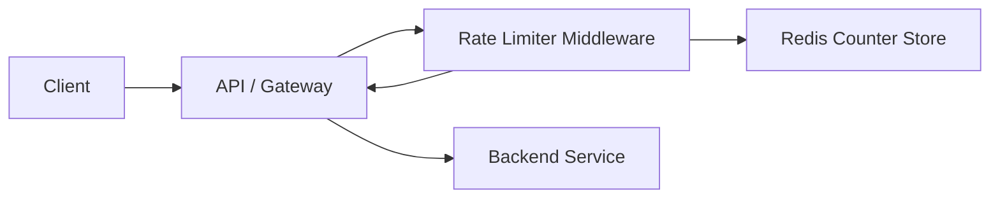

# System Design Rate Limiter

This repository documents the design of an API rate limiter that protects
backend services from abuse, accidental traffic spikes, and noisy clients.

It is written as a system design artifact rather than a production codebase. The
goal is to show clear architectural reasoning, tradeoff analysis, and practical
implementation choices for a common distributed systems problem.

## Problem Statement

Design a rate limiter that enforces a rule such as:

```text
Allow 100 requests per minute per IP address.
```

When a client exceeds the configured limit, the API should return:

```text
HTTP 429 Too Many Requests
```

The design should be simple enough to operate, fast enough to run on every API
request, and scalable enough to support multiple API servers.

## High-Level Architecture



## Request Flow

1. A client sends a request to the API.
2. The API extracts the client identifier, such as an IP address.
3. The rate limiter calculates the current time window.
4. Redis increments a counter for that client and window.
5. If the counter is within the limit, the request continues to the backend.
6. If the counter exceeds the limit, the API returns `429 Too Many Requests`.

## Algorithm

This design uses a **Fixed Window Counter** backed by Redis.

Redis key format:

```text
rl:ip:{ip}:{windowStart}
```

Example:

```text
rl:ip:203.0.113.10:1710000000
```

Core Redis operations:

```text
INCR key
EXPIRE key 60
```

The first request in a window creates the counter and applies a TTL. Later
requests increment the same key until the window expires.

## Design Decisions

| Decision | Rationale |
| --- | --- |
| Middleware placement | Keeps rate limiting close to API ingress and protects backend services early. |
| Redis as shared state | Allows multiple API instances to enforce the same limits consistently. |
| Fixed window counter | Easy to understand, cheap to execute, and suitable for baseline protection. |
| TTL-based cleanup | Removes old counters automatically without a separate cleanup job. |
| Per-IP limit | Simple client identity model for public APIs and unauthenticated traffic. |

## Tradeoffs

The fixed window counter is intentionally simple, but it has known limitations:

- It can allow burst traffic around window boundaries.
- IP-based limits can unfairly group users behind NAT or shared networks.
- Redis availability becomes part of the request path.
- Clock consistency matters when multiple API servers calculate windows.

For stricter fairness, the design could evolve to a sliding window log, sliding
window counter, token bucket, or leaky bucket algorithm.

## Scalability Considerations

- Use Redis clustering or managed Redis for higher throughput and availability.
- Use atomic Redis operations or Lua scripts when multiple commands must behave
  as one operation.
- Apply different limits by route, API key, user tier, or service plan.
- Add observability for allow/block counts, Redis latency, and top limited
  clients.
- Decide fail-open or fail-closed behavior for Redis outages based on the risk
  profile of the API.

## Repository Structure

```text
.
├── README.md
└── docs
    ├── algorithms.md
    └── architecture.md
```

Additional notes:

- [Architecture](docs/architecture.md)
- [Rate limiting algorithm](docs/algorithms.md)

## Purpose

This repository documents a rate limiter system design in a concise, reviewable
format. It focuses on architecture, algorithm choice, tradeoffs, and scalability
considerations.

## License

This project is licensed under the MIT License. See [LICENSE](LICENSE).
