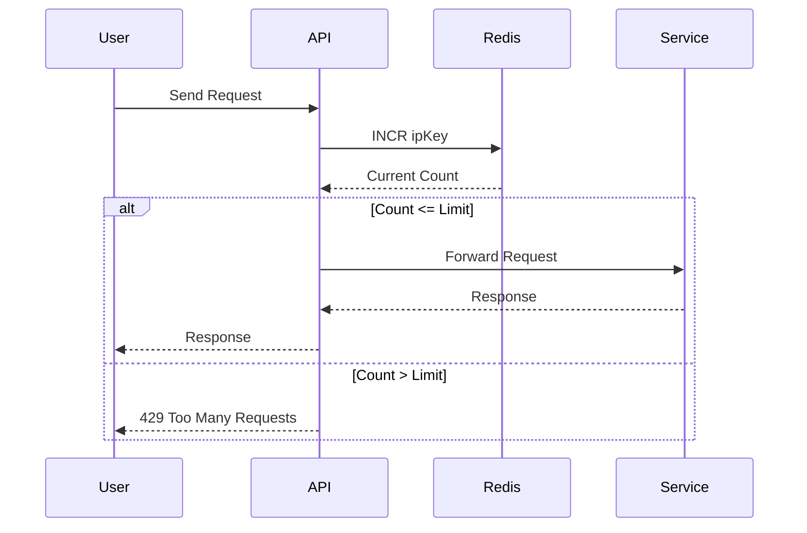

# Architecture – Simple Rate Limiter

The rate limiter works as a middleware inside the API layer.

Every request passes through the rate limiter before reaching the backend service.

## Components

Client  
User sending requests to the API.

API / Gateway  
Handles incoming requests and applies the rate limiter.

Rate Limiter  
Checks whether the request should be allowed or blocked.

Redis  
Stores counters for each IP address.

Backend Service  
Processes requests if the rate limit allows them.

## Request Flow

